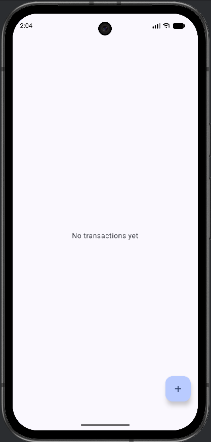
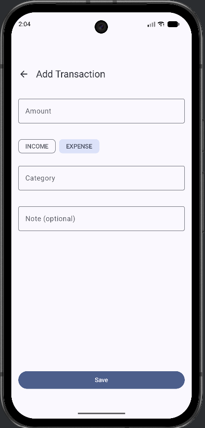
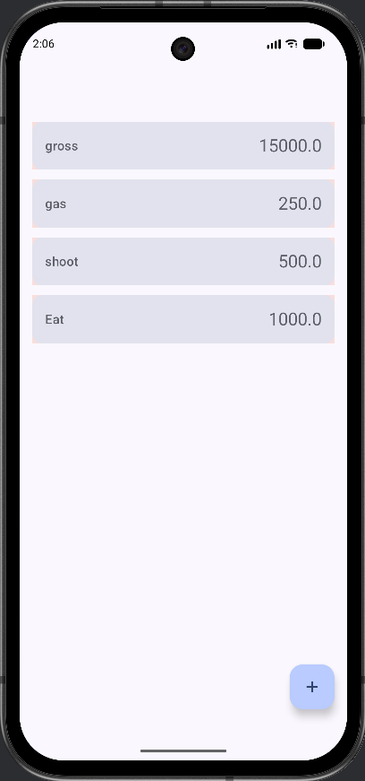
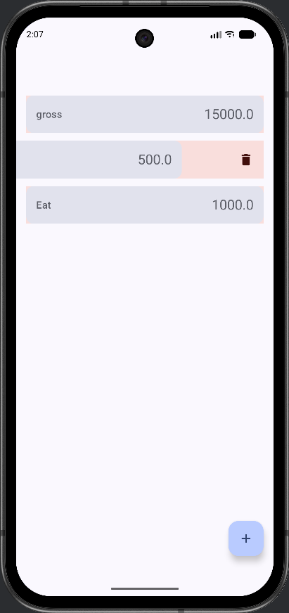

# Pocket Finance Lite

**EN:** An Android expense tracker built with Jetpack Compose, MVVM/UDF, Room and Hilt (offline-first).  
**VI:** Ứng dụng quản lý chi tiêu cá nhân (thu/chi) xây bằng Jetpack Compose, MVVM/UDF, Room và Hilt (ưu tiên offline).

## Getting started
### Requirements
- Android Studio (latest stable)
- JDK 17+

### Run
1. Open the project in Android Studio
2. Sync Gradle
3. Run the `app` configuration on an emulator/device (API 24+)

## Screenshots

| Empty State | Add Transaction | Transaction List | Swipe to Delete |
|---|---|---|---|
|  |  |  |  |

## Features
- [x] Add / edit transaction (amount, type, category, note, date)
- [x] Input validation
- [x] Delete transaction (swipe-to-delete)
- [x] Offline-first with Room database
- [ ] Monthly summary
- [ ] Filter by category
- [ ] Fixed categories: Food, Transport, Bills, Shopping, Health, Entertainment, Other

## Tech stack
- Kotlin
- Jetpack Compose + Material 3
- Navigation Compose
- Room (local database)
- Hilt (Dependency Injection)
- Kotlin Coroutines + Flow

## Architecture (high level)
**EN:** Clean Architecture + MVVM + Unidirectional Data Flow (UDF): UI emits events → ViewModel updates state → UI renders state.  
**VI:** Clean Architecture + MVVM + UDF: UI gửi event → ViewModel xử lý và cập nhật state → UI render theo state.

## Author
- Dang Tran Anh Quan (HCMC, Vietnam)